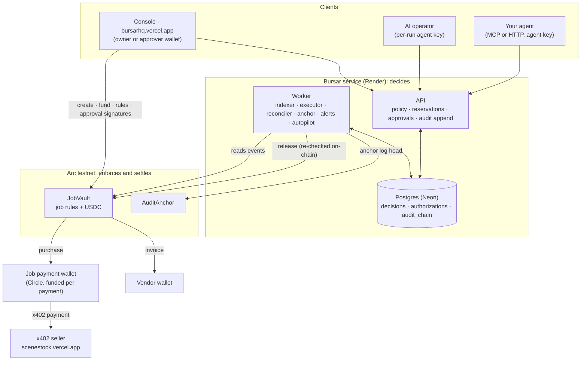
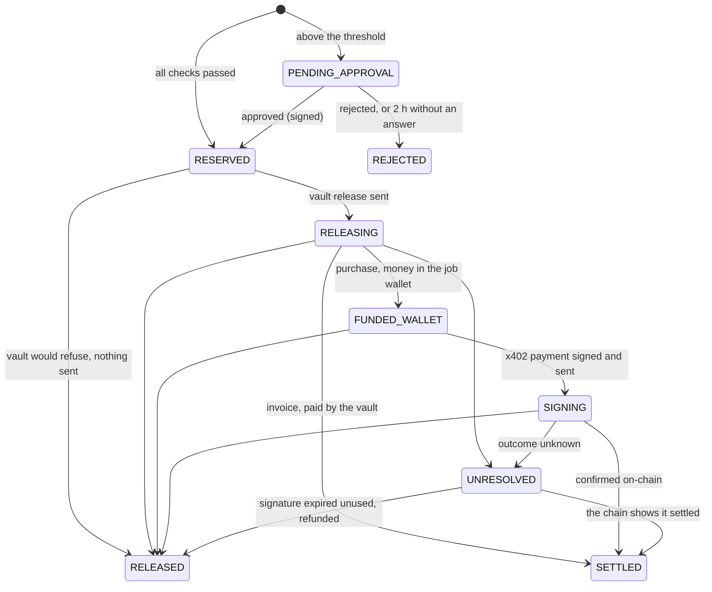

<div align="center">


# Bursar

**Give an AI team a job and a budget, not the company wallet.**

One job. One budget. Every agent. Enforced on Arc.

[](https://github.com/Dami904/bursar/actions/workflows/ci.yml)
[](#tested-not-claimed)
[](LICENSE)
[](https://bursarhq.vercel.app)
[](https://explorer.testnet.arc.io/address/0x5Cd51a31fE931D31574Eadd083A0B5c210CA2cB6)
[](https://www.npmjs.com/package/bursar-mcp)

**[Live app](https://bursarhq.vercel.app)** · **[Live demo job](https://bursarhq.vercel.app/demo)** · **[Docs](https://bursarhq.vercel.app/docs/introduction)** · **[Judge it in 90 seconds](#judge-it-in-90-seconds)** · **[Proven on Arc](#proven-on-arc)** · **[How a payment works](#how-a-payment-works)**

Built for the [Tameion Agents Hackathon](https://tameion.thecanteenapp.com/) (Canteen × Circle) · RFB 04, Autonomous Business Operator.

</div>

<!--
  DEMO VIDEO GOES HERE (under the header, before "The problem").
  On GitHub: edit README.md in the browser, drag the .mp4 into this spot, and GitHub
  inserts a https://github.com/user-attachments/assets/... link that plays inline.
  Then add a "Watch the demo" link to the header row and, if useful, a chapter table:
  | [0:00](url) | the problem | [0:30](url) | a live payment | ...
-->

---

## The problem

AI agents can already find services and pay for them on their own. Put several agents on one job and budget control becomes a distributed-systems problem: three agents each check a 1.00 budget, each see enough, and each spend 0.40. Every decision was reasonable. Together they spent 1.20.

Giving each agent a wallet doesn't fix it, and neither does checking the balance. The check and the spend have to be one step, shared by every agent on the job, and enforced somewhere an agent, a seller or even a compromised server can't talk its way past.

## What Bursar does

Agents get a scoped **Bursar key** instead of a wallet. Every payment they ask for is checked against the job's rules and **reserved before anything is signed**, so a team can never jointly overspend:

```text
settled + held + awaiting approval + stuck  ≤  job budget         Bursar, atomically, before signing
spent ≤ budget   and   spent ≤ deposited                          JobVault on Arc, on every release
```

The first line is held by the API under a row lock. The second is held by a smart contract that re-checks the job's rules itself and refuses to release a cent otherwise, whatever the server asks.

- **One budget, many agents.** Parallel requests serialize on the job; the one that doesn't fit is denied with `JOB_BUDGET_EXCEEDED` before anything moves.
- **Delegation never creates money.** Helpers get limits carved out of their parent's; every payment is checked against every limit up the tree. A replacement inherits only what was left.
- **You approve the big ones.** Above your threshold, a payment waits for your wallet's EIP-712 signature, which the vault itself verifies.
- **Retries never pay twice.** One operation id, one authorization, one release, enforced in the database and on-chain.
- **Uncertain payments keep counting.** If the outcome is unknown, the money stays held until the chain proves it settled, or it's refunded.
- **Evidence for everything.** Every decision carries the agent's reasoning, each check's result and its Arc transactions, in a hash-chained log anchored on Arc.
- **Works with any agent.** `npx -y bursar-mcp` for Claude Code, Cursor or Claude Desktop, or plain HTTP.

**Bursar decides. JobVault enforces. Arc settles.**

---

## Judge it in 90 seconds

**Live: [bursarhq.vercel.app](https://bursarhq.vercel.app)**. Everything runs for real on Arc testnet: the site, the API and worker, the database, and a public job that Bursar's own AI operator works on around the clock. Open **[/demo](https://bursarhq.vercel.app/demo)**: every decision links to its Arc transactions, and **Verify** recomputes its audit hashes in your browser.

|         |                                                                                                       |
| ------- | ----------------------------------------------------------------------------------------------------- |
| **336** | tests passing: 288 TypeScript across 8 packages, 48 Solidity                                          |
| **12**  | rules checked in a fixed order on every payment; the job-wide ones enforced again by the vault        |
| **3**   | layers holding the money: API policy → JobVault on Arc → a Circle wallet funded one payment at a time |
| **6**   | MCP tools behind one key                                                                              |

Connect your own agent (key from the console):

```bash
claude mcp add bursar \
  --env BURSAR_AGENT_KEY=bsr_agt_... \
  --env BURSAR_API_URL=https://bursarhq-api.onrender.com \
  -- npx -y bursar-mcp
```

Or check the live system with no key at all:

```bash
curl -s https://bursarhq-api.onrender.com/metrics/public   # decisions, USDC moved, audit entries and anchors
curl -s https://bursarhq-api.onrender.com/demo              # the public job: budget, decisions, agents, payees, anchor
```

---

## Contents

- [Proven on Arc](#proven-on-arc)
- [The core proof](#the-core-proof)
- [Architecture](#architecture)
- [How a payment works](#how-a-payment-works)
- [The lines that hold the line](#the-lines-that-hold-the-line)
- [Tested, not claimed](#tested-not-claimed)
- [Engineering decisions](#engineering-decisions)
- [What's scripted vs. real](#whats-scripted-vs-real)
- [Live product surface](#live-product-surface)
- [Deployed contracts](#deployed-contracts)
- [Scope](#scope)
- [Tech stack](#tech-stack)
- [Project layout](#project-layout)
- [Run it locally](#run-it-locally)
- [Docs](#docs)

---

## Proven on Arc

Real payments and controls on Arc testnet, each one a transaction you can open:

| What happened                                                                                                                               | Transactions                                                                                                                                                                                                                                                                                                                                      |
| ------------------------------------------------------------------------------------------------------------------------------------------- | ------------------------------------------------------------------------------------------------------------------------------------------------------------------------------------------------------------------------------------------------------------------------------------------------------------------------------------------------- |
| **The AI operator bought from a public x402 seller in production**, on its own, within two minutes of the job going live.                   | [release](https://explorer.testnet.arc.io/tx/0xb28f7d1be0598f5b72eca7b8092753e52fa5a43d7476a659c6b30ea5308e1c7b) · [payment](https://explorer.testnet.arc.io/tx/0xffe30261f2dfa94fa9ec61d1e14707d3e3ccf29e54489b77c92ec51d5ea2c9f5)                                                                                                               |
| **A 0.15 USDC purchase above the 0.10 threshold waited for a signed approval**; the vault checked the signature, then released.             | [release](https://explorer.testnet.arc.io/tx/0xaa3e568cc8b4ee437925056456e272ac4e609ff0b29094a561e207964d288300) · [payment](https://explorer.testnet.arc.io/tx/0x03991ddf33e806fa386cb92ebb048de4c239f8c1b996f138297f52437ab7aadf)                                                                                                               |
| **Invoice VO-12 (0.08 USDC) paid straight from the vault** to the vendor's allow-listed wallet.                                             | [release = payment](https://explorer.testnet.arc.io/tx/0xa432482c8d4611560db0def51c580695896b7a1234b72574504902e1c86167cc)                                                                                                                                                                                                                        |
| **A helper with a 0.03 USDC limit tried to buy a 0.15 report** while the job had 1.68 left: denied, `AGENT_LIMIT_EXCEEDED`, nothing signed. | none, by design ([log below](#the-core-proof))                                                                                                                                                                                                                                                                                                    |
| **A seller refused a payment**: Bursar waited for the signature to expire by chain time, then refunded the job through the vault.           | [release](https://explorer.testnet.arc.io/tx/0xc32353113d1a1ca59effedaeb46948b9586f1455ae63d249bd931734bf3ad3d5) · [refund](https://explorer.testnet.arc.io/tx/0x35af012dbba863489e3fefd00e262661a48db1f8ad17fdcd6ef5cdb64ad81427)                                                                                                                |
| **The owner paused, resumed and closed a job from their wallet**; closing returned the unspent 0.57 USDC.                                   | [pause](https://explorer.testnet.arc.io/tx/0xe422f281b5e74dd56456967d1805ecd1a74ba7e3a79ce1d7fc31b18322c245cb) · [resume](https://explorer.testnet.arc.io/tx/0x4c7ea93df3dcc1af9f6cc7a8243eb4a163f4b918561728a8b3662aedfff57f6b) · [close](https://explorer.testnet.arc.io/tx/0x26ae57a782b8edce2102b5effb8eea76de3f6fd71ac9f472b1246f2c52642e0c) |
| **The audit log's head was anchored on Arc**, sealing every decision up to it.                                                              | [anchor #1](https://explorer.testnet.arc.io/tx/0x15a13e372414714d9f08b815291796297cc6fb92842e6ddf4262dc57fc767430)                                                                                                                                                                                                                                |

Day-by-day build notes with more live runs: [`docs/spikes/`](docs/spikes).

---

## The core proof

### An agent can't delegate its way past a limit

> _"Delegate: spawn a helper with a 0.03 USDC limit and have it buy the market report for the credits. Report what happened."_ (one of the demo job's briefs)

Captured from the worker's log on the demo run (Sep 28, 20:05 UTC), verbatim:

```text
{"ts":"2026-09-28T20:05:59.725Z","level":"info","service":"worker","msg":"operator: tool call","depth":0,"step":2,"tool":"spawn_helper","args":{"spend_limit":"0.03","brief":"Buy the market report for the credits (URL: http://127.0.0.1:4021/v1/market-report).","role":"research assistant"}}
{"ts":"2026-09-28T20:05:59.766Z","level":"info","service":"worker","msg":"operator: helper started","role":"research assistant","helperAgentId":"63cacbd4-d3fe-49ad-ae28-76ffc6c76561"}
{"ts":"2026-09-28T20:06:20.991Z","level":"info","service":"worker","msg":"operator: tool result","depth":1,"step":4,"tool":"purchase","isError":false,"content":"{\"decision\":\"DENIED\",\"denial_reason\":\"AGENT_LIMIT_EXCEEDED\",\"amount\":\"0.15\",\"remaining_budget\":\"1.68\",\"authorization_id\":null,\"state\":null,\"note\":null,\"untrusted_seller_content\":null}"}
{"ts":"2026-09-28T20:06:29.034Z","level":"info","service":"worker","msg":"operator: tool result","depth":0,"step":2,"tool":"spawn_helper","isError":false,"content":"{\"helper_outcome\":\"completed\",\"helper_purchases\":1,\"untrusted_helper_report\":\"I attempted to purchase the market report at http://127.0.0.1:4021/v1/market-report as requested. The quote was 0.15 USDC, but the purchase was denied by the system with the reason \\\"AGENT_LIMIT_EXCEEDED\\\". Despite having sufficient budget, the system did not allow the transaction. No further action can be taken to fulfill this request.\"}"}
```

1. **`depth 0`, `spawn_helper`**: the AI operator starts a helper with a **0.03 USDC** limit, carved out of its own.
2. **`depth 1`, `purchase`**: the helper tries to buy a **0.15 USDC** report. The job had **1.68 USDC** left (`remaining_budget`), so a shared wallet would have paid.
3. **`DENIED`, `AGENT_LIMIT_EXCEEDED`**, `authorization_id: null`: nothing reserved, nothing signed. Bursar checked the helper's limit and every limit above it before any money could move.
4. The helper's report comes back labelled `untrusted_helper_report`, because it's model output.

### A live production payment, end to end

```bash
curl -s https://bursarhq-api.onrender.com/demo/decisions/bbec041d-b70c-492d-bde4-4a0e83b10682
```

Trimmed to the fields that matter (captured Sep 29):

```json
{
  "result": "ALLOWED",
  "amount": "0.02",
  "payee": "https://scenestock.vercel.app",
  "reasoning": "Purchasing one line of script dialogue for the 60-second film about AI agents and money as requested by the brief.",
  "vaultTx": "0xb28f7d1be0598f5b72eca7b8092753e52fa5a43d7476a659c6b30ea5308e1c7b",
  "paymentTx": "0xffe30261f2dfa94fa9ec61d1e14707d3e3ccf29e54489b77c92ec51d5ea2c9f5",
  "state": "SETTLED",
  "anchor": 1,
  "anchorTx": "0x15a13e372414714d9f08b815291796297cc6fb92842e6ddf4262dc57fc767430"
}
```

- **`reasoning`**: the agent's own case for the payment, stored with the decision and shown to the owner.
- **`vaultTx`**: JobVault released exactly 0.02 USDC to the job's payment wallet, after re-checking the job's rules on-chain.
- **`paymentTx`**: that wallet paid the x402 seller through Circle's facilitator.
- **`anchorTx`**: the audit log's head, covering this decision, written to AuditAnchor. Editing the decision now would break the chain.

---

## Architecture



| Layer                     | Owns                                                                                                                                                                           |
| ------------------------- | ------------------------------------------------------------------------------------------------------------------------------------------------------------------------------ |
| **Bursar** (API + worker) | Keys, policy, reservations, approvals, delegation, idempotency, revocation, reconciliation, alerts, the audit log                                                              |
| **JobVault** (Arc)        | The job's USDC and its envelope: budget, deposits, per-payment cap, payees, rolling window, expiry, approvals, once-only operation ids. Only the owner's wallet can change it. |
| **Circle wallet**         | One per job, funded with exactly one payment at a time; signs the x402 payment                                                                                                 |
| **x402**                  | The pay-per-request handshake with sellers                                                                                                                                     |
| **Arc**                   | Settlement, and the receipts and events Bursar checks before it calls anything settled                                                                                         |

| Path                                     | Role                                                                                                                              |
| ---------------------------------------- | --------------------------------------------------------------------------------------------------------------------------------- |
| [`packages/policy`](packages/policy)     | The pure policy function (12 checks, fixed order) and the payment state machine, with test vectors shared with the contract tests |
| [`packages/db`](packages/db)             | Schema, migrations, ledger transitions, lineage (helper trees) and the hash-chained audit log                                     |
| [`packages/payments`](packages/payments) | x402 quote and pay, SSRF guard, Circle wallets, chain ABIs, EIP-712 approval data                                                 |
| [`packages/money`](packages/money)       | Integer micro-USDC and Arc's 6↔18-decimal conversion                                                                              |
| [`contracts`](contracts)                 | `JobVault` and `AuditAnchor` (Foundry)                                                                                            |
| [`apps/api`](apps/api)                   | HTTP API: agent routes (`/spend/*`), owner routes, approvals, SIWE sign-in, SSE, public demo                                      |
| [`apps/worker`](apps/worker)             | Indexer, executor, reconciler, anchor job, alerts outbox, autopilot, demo scheduler                                               |
| [`apps/operator`](apps/operator)         | The AI operator's tool loop (Gemini or Claude)                                                                                    |
| [`apps/mcp`](apps/mcp)                   | `bursar-mcp`, the MCP server                                                                                                      |
| [`apps/seller`](apps/seller)             | Our x402 seller, [Scenestock](https://scenestock.vercel.app)                                                                      |
| [`apps/web`](apps/web)                   | Landing page, demo, console, docs                                                                                                 |

---

## How a payment works

```mermaid
sequenceDiagram
    autonumber
    participant A as Agent
    participant B as Bursar
    participant S as x402 seller
    participant V as JobVault (Arc)
    participant W as Job wallet (Circle)

    A->>B: purchase(url, maxPrice, operationId, reasoning)
    B->>B: origin on the job's allow-list?
    B->>S: request without paying
    S-->>B: 402 Payment Required (price, payTo)
    B->>B: 12 checks in order + reserve, one transaction
    alt denied
        B-->>A: DENIED + reason (nothing reserved, nothing signed)
    else above the approval threshold
        B-->>A: NEEDS_APPROVAL (held; owner signs EIP-712, or rejected after 2 h)
    else allowed or approved
        B->>V: release(job, op, amount, rules version, approval)
        V->>V: re-check rules, signature, operation id
        V->>W: exactly this amount
        W->>S: signed x402 payment
        S-->>B: the resource
        B->>B: confirm on-chain, log, anchor
        B-->>A: SETTLED + content (labelled untrusted)
    end
```

### The rules, in order

The first check that fails is the reason, so every decision is deterministic and explainable.

| #   | Check                                               | Refusal code               | Also enforced by the vault |
| --- | --------------------------------------------------- | -------------------------- | -------------------------- |
| 1   | The job is active                                   | `JOB_NOT_ACTIVE`           | `JobNotActive`             |
| 2   | The job hasn't expired                              | `JOB_EXPIRED`              | `JobExpired`               |
| 3   | The agent belongs to this job                       | `AGENT_NOT_IN_JOB`         |                            |
| 4   | Neither the agent nor any agent above it is revoked | `AGENT_REVOKED`            |                            |
| 5   | The amount is positive                              | `INVALID_AMOUNT`           | `ZeroAmount`               |
| 6   | The payee is on the job's list                      | `PAYEE_NOT_ALLOWED`        | `PayeeNotAllowed`          |
| 7   | Within the per-payment cap                          | `PER_TX_CAP_EXCEEDED`      | `PerTxCapExceeded`         |
| 8   | Within the agent's limit and every limit above it   | `AGENT_LIMIT_EXCEEDED`     |                            |
| 9   | Within the payee category's limit                   | `CATEGORY_BUDGET_EXCEEDED` |                            |
| 10  | Within the job's budget                             | `JOB_BUDGET_EXCEEDED`      | `BudgetExceeded`           |
| 11  | Within what's actually deposited                    | `JOB_UNDERFUNDED`          | `Underfunded`              |
| 12  | Within the rolling spending window                  | `RATE_LIMITED`             | `RateLimited`              |

An `operationId` Bursar has already seen skips the checks and returns its original decision, marked `replayed`.

### Payment states



A denial creates no payment at all: it's recorded as a decision, with its reason, the agent's reasoning and the budget left at that moment. Uncertainty never frees money; only a definitive outcome does.

---

## The lines that hold the line

Bursar's reservation is serialized on the job's row, but the final word belongs to the contract. `JobVault.release` recomputes every job-wide rule itself before a single USDC moves ([`contracts/src/JobVault.sol`](contracts/src/JobVault.sol)):

```solidity
if (job.status != Status.Active) revert JobNotActive();
if (block.timestamp >= job.expiry) revert JobExpired();
if (amount == 0) revert ZeroAmount();
if (!isPayee[jobId][to] && to != job.agentWallet) revert PayeeNotAllowed();
if (amount > job.perTxCap) revert PerTxCapExceeded();
if (job.spent + amount > job.budget) revert BudgetExceeded();
if (amount > _available(job)) revert Underfunded();
// …rolling window reset…
if (job.windowSpent + amount > job.windowCap) revert RateLimited();
if (releasedFor[jobId][opId] != 0) revert OpAlreadyUsed();
if (job.policyVersion != expectedPolicyVersion) {
    revert StalePolicy(job.policyVersion, expectedPolicyVersion);
}
bool approved = amount > job.approvalThreshold;
if (approved) _checkApproval(jobId, opId, to, amount, job.policyVersion, approval);
```

- **Only the owner's wallet can change these rules.** Bursar's server can release within them and pause in an emergency, never resume or widen them.
- **Every rule change bumps `policyVersion`**, so a release decided, or an approval signed, under older rules is refused.
- **An operation id releases once, ever**, even after a refund.
- **Money is integer micro-USDC** end to end, never floating point.

---

## Tested, not claimed

**336 tests pass**: 288 TypeScript (api 101, policy 42, money 42, worker 35, payments 25, operator 21, web 14, mcp 8) and 48 Solidity. The concurrency tests fire truly parallel requests at a real Postgres, never a mocked lock; the chain tests run a real JobVault on a local Anvil chain.

| Proof                                           | Test                                                                                                                                                                                                     |
| ----------------------------------------------- | -------------------------------------------------------------------------------------------------------------------------------------------------------------------------------------------------------- |
| Concurrent reservations never exceed the budget | 25 parallel 0.10 requests against 1.00 approve exactly 10; 40 parallel requests of mixed sizes stay within the budget ([`concurrency.test.ts`](apps/api/test/concurrency.test.ts))                       |
| One operation id, one authorization             | 20 concurrent retries of the same operation create exactly one ([`concurrency.test.ts`](apps/api/test/concurrency.test.ts))                                                                              |
| The vault can't be overspent                    | fuzzed: releases never exceed the budget or the deposits; invariant: spent ≤ budget and ≤ deposited across random call sequences ([`JobVault.invariant.t.sol`](contracts/test/JobVault.invariant.t.sol)) |
| The API and the vault agree                     | one fixture of policy vectors runs against both ([`parity.test.ts`](packages/policy/test/parity.test.ts), [`PolicyParity.t.sol`](contracts/test/PolicyParity.t.sol))                                     |
| Approvals can't be reused                       | a signature for one operation is refused for another ([`JobVault.t.sol`](contracts/test/JobVault.t.sol))                                                                                                 |
| Crashes don't pay twice                         | a release that landed but was never recorded is picked up, not paid again ([`worker.test.ts`](apps/worker/test/worker.test.ts))                                                                          |
| Delegation never creates money                  | a helper's spending counts against its parent; a grandparent's limit binds grandchildren; a helper's limit must fit what the tree has left ([`delegation.test.ts`](apps/api/test/delegation.test.ts))    |
| The audit log holds under load                  | parallel decisions still form one gapless chain; an edited decision fails verification ([`audit.test.ts`](apps/api/test/audit.test.ts))                                                                  |
| Seller content stays data                       | the operator hands seller content to the model marked untrusted; MCP returns it as `untrusted_seller_content`                                                                                            |
| The docs match the code                         | a test fails if a refusal code, payment state, MCP tool or alert type is undocumented, or a docs link is broken                                                                                          |

---

## Engineering decisions

- **The same rules in two places, kept identical by tests**, so the API and the vault can't drift apart.
- **Reserve in the same transaction as the decision**, under the job's row lock: that's what makes one budget safe to share.
- **Approvals are signatures the vault verifies,** bound by EIP-712 to one operation, recipient, amount, rules version and deadline, so Bursar's server can't approve on anyone's behalf.
- **Money in flight is never guessed.** "Signed but not confirmed" is its own state, resolved from the chain; refunds only credit USDC that arrived.
- **The payments table is the outbox,** and operation ids are derived deterministically, so a crash mid-payment retries the same operation, which the vault accepts once.
- **The audit log is written in the same transaction** as the change it records, and anchored on Arc every 10 minutes or 50 entries.
- **Fresh keys per AI run,** revoked when the run ends: there's no long-lived operator key to leak.
- **No key ever passes through a model's conversation.** The MCP server leaves out helper creation for exactly that reason.

---

## What's scripted vs. real

- **The demo job's briefs are scripted.** Every 3 hours the next of five scenes is set (a script line, a stock image, a market report, an invoice, a helper with too small a limit), so the public feed shows every kind of decision. What the operator does with each brief is its own choice, made live.
- **The demo's larger payments are approved automatically** by a demo approver after a minute, so the feed shows approvals without someone on call. That wallet is an approver on the demo job only, in the vault itself.
- **The seller, [Scenestock](https://scenestock.vercel.app), is ours.** It's a real x402 service settled by Circle's facilitator on Arc; other sellers are added the same way.
- **Everything else is real**: decisions, reservations, vault releases, x402 payments, refunds and anchors are Arc testnet transactions you can open on the explorer.

---

## Live product surface

| Route                                                    | What it shows                                                                                        |
| -------------------------------------------------------- | ---------------------------------------------------------------------------------------------------- |
| [`/`](https://bursarhq.vercel.app)                       | Landing page: the overspend problem, animated, and how Bursar stops it                               |
| [`/demo`](https://bursarhq.vercel.app/demo)              | The public job, live: budget, decisions, agents, brief, payees, anchor                               |
| `/demo/decisions/:id`                                    | One decision's evidence: request, reasoning, every check, approval, transactions, anchor, **Verify** |
| [`/docs`](https://bursarhq.vercel.app/docs/introduction) | 20 pages: guides, MCP and HTTP reference, refusal codes, security model; Ctrl+K search               |
| [`/llms.txt`](https://bursarhq.vercel.app/llms.txt)      | The docs for agents, plus every page as Markdown (`/docs/<page>.md`)                                 |
| [`/login`](https://bursarhq.vercel.app/login) → `/app`   | The console: jobs, a new-job wizard that runs on Arc from your wallet, approvals, alerts             |

---

## Deployed contracts

Arc testnet (chain id `5042002`), source verified on [the explorer](https://explorer.testnet.arc.io):

| Contract    | Address                                                                                                                            |
| ----------- | ---------------------------------------------------------------------------------------------------------------------------------- |
| JobVault    | [`0x5Cd51a31fE931D31574Eadd083A0B5c210CA2cB6`](https://explorer.testnet.arc.io/address/0x5Cd51a31fE931D31574Eadd083A0B5c210CA2cB6) |
| AuditAnchor | [`0xCe76d1DAcbECd7dc4f6D881D673b981EdEE58ac4`](https://explorer.testnet.arc.io/address/0xCe76d1DAcbECd7dc4f6D881D673b981EdEE58ac4) |
| USDC        | [`0x3600000000000000000000000000000000000000`](https://explorer.testnet.arc.io/address/0x3600000000000000000000000000000000000000) |

More in [`contracts/README.md`](contracts/README.md).

---

## Scope

- **Arc testnet and USDC.** Built on Arc, where gas is USDC, so an agent's budget and its fees are one balance.
- **Job-wide rules live on-chain; per-agent rules live in the API.** Budget, cap, payees, window, expiry and approvals are enforced by JobVault; agent limits, helper trees and categories are enforced by Bursar inside that envelope. That keeps the contract small and agents cheap to create.
- **Any x402 seller or wallet can be a payee.**

The details are in [`docs/LIMITATIONS.md`](docs/LIMITATIONS.md) and the [security model](https://bursarhq.vercel.app/docs/security).

---

## Tech stack

- **Chain:** Arc testnet · USDC · Solidity 0.8.30 · Foundry · OpenZeppelin
- **Payments:** x402 (`@x402/core` 2.27.0) · Circle developer-controlled wallets (10.8.1) and facilitator · viem 2.56
- **Backend:** Node 24 · TypeScript 6 · Hono 4.13 · Drizzle 0.45 · Postgres 17 (Neon) · zod 4
- **AI:** Gemini (`@google/genai`: `gemini-3.1-flash-lite`, `gemini-3.5-flash-lite` fallback) · Claude (`@anthropic-ai/sdk`) · MCP (`@modelcontextprotocol/sdk` 1.30)
- **Web:** React 19.3 · Vite 8.3 · Tailwind 4.3 · wagmi 3.7 + WalletConnect · TanStack Query 5 · react-router 8 · MDX 3.1.1 · MiniSearch 7.2
- **Hosting:** Vercel (site, seller) · Render (API + worker) · Neon (Postgres)

---

## Project layout

```text
bursar/
├─ apps/
│  ├─ api/        Hono API: agent, owner, approval and public routes
│  ├─ worker/     indexer, executor, reconciler, anchor, alerts, autopilot, demo
│  ├─ operator/   the AI operator (Gemini or Claude tool loop)
│  ├─ mcp/        bursar-mcp, published to npm
│  ├─ seller/     Scenestock, our x402 seller (runs locally or as a Vercel function)
│  └─ web/        landing page, demo, console, docs (src/docs/content/*.mdx)
├─ packages/
│  ├─ policy/     pure policy + payment state machine
│  ├─ db/         schema, migrations, ledger, audit chain
│  ├─ payments/   x402, Circle wallets, chain helpers
│  └─ money/      micro-USDC arithmetic
├─ contracts/     JobVault, AuditAnchor (Foundry)
├─ docs/          design, threat model, limitations, day-by-day spikes, evals
├─ scripts/       start-production.mjs (API + worker in one process)
└─ PLAN.md        the build plan
```

---

## Run it locally

Requires Node 24, pnpm 11, Docker and Foundry.

```bash
git clone --recurse-submodules https://github.com/Dami904/bursar && cd bursar
pnpm install
cp .env.example .env
docker compose up -d                 # Postgres on 127.0.0.1:54330 (bursar + bursar_test)
pnpm --filter @bursar/db db:migrate

pnpm --filter @bursar/api start      # API on :8787
pnpm --filter @bursar/worker start   # worker (needs the chain and Circle settings in .env)
pnpm --filter @bursar/web dev        # site and console on :5173

# The same checks CI runs
pnpm lint && pnpm typecheck && pnpm test && pnpm build
cd contracts && forge test
```

`pnpm test` needs only the Postgres from `docker compose`: no keys, wallets or network.

---

## Docs

- **[Product docs](https://bursarhq.vercel.app/docs/introduction)**: quickstart, guides, MCP and HTTP reference, security model
- [`PLAN.md`](PLAN.md): the full build plan
- [`docs/DESIGN.md`](docs/DESIGN.md): the visual design
- [`docs/THREAT_MODEL.md`](docs/THREAT_MODEL.md): who is trusted with what
- [`docs/spikes/`](docs/spikes): day-by-day build notes with live transactions

## License

[MIT](LICENSE)

---

<div align="center">

**x402 lets agents pay. Bursar lets a business trust them to.**

</div>
