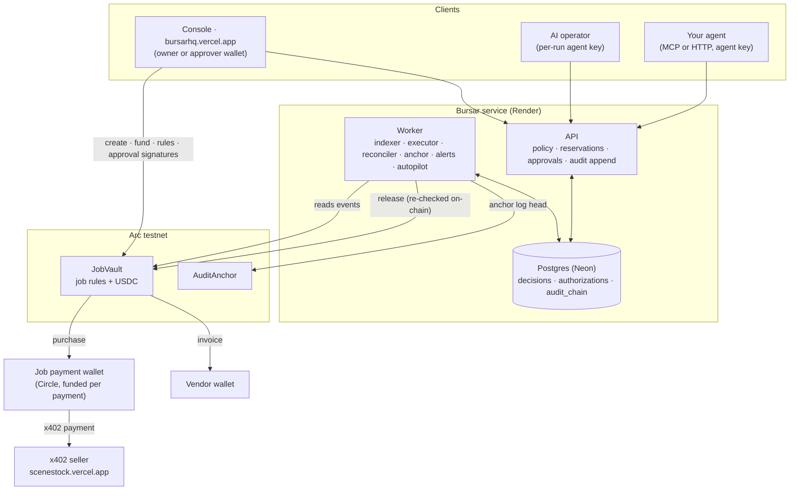

<div align="center">


# Bursar

[](https://github.com/Dami904/bursar/actions/workflows/ci.yml)
[](https://github.com/Dami904/bursar/actions/workflows/ci.yml)
[](LICENSE)
[](https://bursarhq.vercel.app)
[](https://explorer.testnet.arc.io/address/0x5Cd51a31fE931D31574Eadd083A0B5c210CA2cB6)
[](https://www.npmjs.com/package/bursar-mcp)

### Give an AI team a job and a budget, not the company wallet.

Agents get a scoped **Bursar key** instead of a wallet. Every payment they ask for is checked against the job's budget, per-payment cap, allowed payees, agent limits and approval threshold, reserved so the team can't jointly overspend, and paid in USDC from a **JobVault contract on Arc** that re-checks the same rules on-chain. Every decision, with the agent's own reasoning, is hash-chained and anchored on Arc.

**[Live app ↗](https://bursarhq.vercel.app)** · **[Live demo job ↗](https://bursarhq.vercel.app/demo)** · **[Judge it in 90 seconds](#judge-it-in-90-seconds)** · **[The core proof](#the-core-proof)** · **[Docs ↗](https://bursarhq.vercel.app/docs/introduction)**

Built for the [Tameion Agents Hackathon](https://tameion.thecanteenapp.com/) (Canteen × Circle) · RFB 04, Autonomous Business Operator.

</div>

---

## Judge it in 90 seconds

**Live: [bursarhq.vercel.app](https://bursarhq.vercel.app)**. Everything runs for real on Arc testnet: the website, the API and worker, the database, and a public job that Bursar's own AI operator works on around the clock. Open **[/demo](https://bursarhq.vercel.app/demo)**: every decision links to its Arc transactions, and **Verify** recomputes its audit hashes in your browser.

|         |                                                                                                                   |
| ------- | ----------------------------------------------------------------------------------------------------------------- |
| **336** | tests passing: 288 TypeScript across 8 packages, 48 Solidity (JobVault, AuditAnchor)                              |
| **12**  | rules checked in a fixed order on every payment; the job-wide ones enforced again by the vault on-chain           |
| **3**   | independent layers holding the money: API policy → JobVault on Arc → a Circle wallet funded one payment at a time |
| **6**   | MCP tools behind one key: `npx -y bursar-mcp`                                                                     |

Connect your own agent in one command (key from the console):

```bash
claude mcp add bursar \
  --env BURSAR_AGENT_KEY=bsr_agt_... \
  --env BURSAR_API_URL=https://bursarhq-api.onrender.com \
  -- npx -y bursar-mcp
```

Or check the live system with no key at all:

```bash
curl -s https://bursarhq-api.onrender.com/metrics/public   # decisions, USDC moved, audit entries and anchors
curl -s https://bursarhq-api.onrender.com/demo              # the public job: budget, decisions, agents, payees, anchor
```

---

## Contents

- [The core proof](#the-core-proof)
- [The problem](#the-problem)
- [What was built](#what-was-built)
- [Architecture](#architecture)
- [How a payment is decided](#how-a-payment-is-decided)
- [Engineering decisions](#engineering-decisions)
- [What's scripted vs. real](#whats-scripted-vs-real)
- [Live product surface](#live-product-surface)
- [Deployed contracts](#deployed-contracts)
- [Scope](#scope)
- [Tech stack](#tech-stack)
- [Project layout](#project-layout)
- [Run it locally](#run-it-locally)
- [Tests](#tests)
- [Docs](#docs)

---

## The core proof

### 1. An agent can't delegate its way past a limit

> _"Delegate: spawn a helper with a 0.03 USDC limit and have it buy the market report for the credits. Report what happened."_ (one of the demo job's briefs)

Captured from the worker's log on the demo run (Sep 28, 20:05 UTC), verbatim:

```text
{"ts":"2026-09-28T20:05:59.725Z","level":"info","service":"worker","msg":"operator: tool call","depth":0,"step":2,"tool":"spawn_helper","args":{"spend_limit":"0.03","brief":"Buy the market report for the credits (URL: http://127.0.0.1:4021/v1/market-report).","role":"research assistant"}}
{"ts":"2026-09-28T20:05:59.766Z","level":"info","service":"worker","msg":"operator: helper started","role":"research assistant","helperAgentId":"63cacbd4-d3fe-49ad-ae28-76ffc6c76561"}
{"ts":"2026-09-28T20:06:20.991Z","level":"info","service":"worker","msg":"operator: tool result","depth":1,"step":4,"tool":"purchase","isError":false,"content":"{\"decision\":\"DENIED\",\"denial_reason\":\"AGENT_LIMIT_EXCEEDED\",\"amount\":\"0.15\",\"remaining_budget\":\"1.68\",\"authorization_id\":null,\"state\":null,\"note\":null,\"untrusted_seller_content\":null}"}
{"ts":"2026-09-28T20:06:29.034Z","level":"info","service":"worker","msg":"operator: tool result","depth":0,"step":2,"tool":"spawn_helper","isError":false,"content":"{\"helper_outcome\":\"completed\",\"helper_purchases\":1,\"untrusted_helper_report\":\"I attempted to purchase the market report at http://127.0.0.1:4021/v1/market-report as requested. The quote was 0.15 USDC, but the purchase was denied by the system with the reason \\\"AGENT_LIMIT_EXCEEDED\\\". Despite having sufficient budget, the system did not allow the transaction. No further action can be taken to fulfill this request.\"}"}
```

Read it top to bottom:

1. **`depth 0`, `spawn_helper`**: the AI operator starts a helper and gives it a **0.03 USDC** limit. That limit is carved out of the operator's own, never added to it.
2. **`depth 1`, `purchase`**: the helper tries to buy a **0.15 USDC** report. The job had **1.68 USDC** left (`remaining_budget`), so a single shared budget would have let it through.
3. **`DENIED`, `AGENT_LIMIT_EXCEEDED`**, `authorization_id: null`: nothing was reserved and nothing was paid. Bursar checked the helper's own limit and every limit above it in its tree before any money could move.
4. The helper reports the refusal back; its text is passed on as `untrusted_helper_report`, because it's model output.

The same job paid for that report correctly, through a human approval, because it was above the 0.10 USDC threshold: [vault release](https://explorer.testnet.arc.io/tx/0xaa3e568cc8b4ee437925056456e272ac4e609ff0b29094a561e207964d288300) → [seller paid](https://explorer.testnet.arc.io/tx/0x03991ddf33e806fa386cb92ebb048de4c239f8c1b996f138297f52437ab7aadf). An invoice (VO-12, 0.08 USDC) went straight from the vault to the vendor's wallet: [tx](https://explorer.testnet.arc.io/tx/0xa432482c8d4611560db0def51c580695896b7a1234b72574504902e1c86167cc).

### 2. A live production payment, end to end

```bash
curl -s https://bursarhq-api.onrender.com/demo/decisions/bbec041d-b70c-492d-bde4-4a0e83b10682
```

Trimmed to the fields that matter (captured Sep 29):

```json
{
  "result": "ALLOWED",
  "amount": "0.02",
  "payee": "https://scenestock.vercel.app",
  "reasoning": "Purchasing one line of script dialogue for the 60-second film about AI agents and money as requested by the brief.",
  "vaultTx": "0xb28f7d1be0598f5b72eca7b8092753e52fa5a43d7476a659c6b30ea5308e1c7b",
  "paymentTx": "0xffe30261f2dfa94fa9ec61d1e14707d3e3ccf29e54489b77c92ec51d5ea2c9f5",
  "state": "SETTLED",
  "anchor": 1,
  "anchorTx": "0x15a13e372414714d9f08b815291796297cc6fb92842e6ddf4262dc57fc767430"
}
```

- **`reasoning`**: the agent's own case for the payment, stored with the decision and shown to the owner.
- **[`vaultTx`](https://explorer.testnet.arc.io/tx/0xb28f7d1be0598f5b72eca7b8092753e52fa5a43d7476a659c6b30ea5308e1c7b)**: JobVault released exactly 0.02 USDC to the job's payment wallet, after re-checking the job's rules on-chain.
- **[`paymentTx`](https://explorer.testnet.arc.io/tx/0xffe30261f2dfa94fa9ec61d1e14707d3e3ccf29e54489b77c92ec51d5ea2c9f5)**: that wallet paid the x402 seller through Circle's facilitator.
- **[`anchorTx`](https://explorer.testnet.arc.io/tx/0x15a13e372414714d9f08b815291796297cc6fb92842e6ddf4262dc57fc767430)**: the audit log's head, covering this decision, written to the AuditAnchor contract. Editing the decision now would break the chain.

---

## The problem

You want an AI agent to finish real work, and real work costs money: data, images, reports, a contractor's invoice. Give the agent a wallet or a card and the only thing between a confused or manipulated agent and your balance is its own judgement. Give a _team_ of agents one budget and they'll each see "1.00 left" and spend it at the same time. Keep them away from money and they can't finish the job. And afterwards, nobody can say who spent what, or why.

---

## What was built

1. **JobVault** (Solidity, Arc testnet): holds each job's USDC and enforces its envelope (budget, deposits, per-payment cap, payees, rolling window, expiry, EIP-712 approvals, once-only operation ids) on every release.
2. **The API** (Hono + Postgres): scoped keys, the 12-rule policy, atomic reservations, x402 purchases, invoices, approvals, helpers and replacements, and a hash-chained audit log.
3. **The worker**: indexes the vault, releases and pays, reconciles uncertain payments into refunds, anchors the audit log, sends alerts (webhooks and Telegram), and runs the AI operator on job briefs.
4. **The AI operator** (Gemini 3.1 Flash-Lite with a fallback model, or Claude): works a job's brief using only a Bursar key, and can start helpers with smaller limits.
5. **`bursar-mcp`** ([npm](https://www.npmjs.com/package/bursar-mcp)): the same spending tools for any MCP agent (Claude Code, Cursor, Claude Desktop).
6. **The console and site**: wallet sign-in, live job pages, phone-first approvals, evidence you can verify in the browser, a public demo, and [docs](https://bursarhq.vercel.app/docs/introduction) with search and `llms.txt`.

**An agent asks → Bursar decides and reserves → the vault re-checks and releases → the seller is paid → the decision is sealed on Arc.**

---

## Architecture



| Path                                     | Role                                                                                                                              |
| ---------------------------------------- | --------------------------------------------------------------------------------------------------------------------------------- |
| [`packages/policy`](packages/policy)     | The pure policy function (12 checks, fixed order) and the payment state machine, with test vectors shared with the contract tests |
| [`packages/db`](packages/db)             | Schema, migrations, ledger transitions, lineage (helper trees) and the hash-chained audit log                                     |
| [`packages/payments`](packages/payments) | x402 quote and pay, SSRF guard, Circle wallets, chain ABIs, EIP-712 approval data                                                 |
| [`packages/money`](packages/money)       | Integer micro-USDC and Arc's 6↔18-decimal conversion                                                                              |
| [`contracts`](contracts)                 | `JobVault` and `AuditAnchor` (Foundry)                                                                                            |
| [`apps/api`](apps/api)                   | HTTP API: agent routes (`/spend/*`), owner routes, approvals, SIWE sign-in, SSE, public demo                                      |
| [`apps/worker`](apps/worker)             | Indexer, executor, reconciler, anchor job, alerts outbox, autopilot, demo scheduler                                               |
| [`apps/operator`](apps/operator)         | The AI operator's tool loop (Gemini or Claude)                                                                                    |
| [`apps/mcp`](apps/mcp)                   | `bursar-mcp`, the MCP server                                                                                                      |
| [`apps/seller`](apps/seller)             | Our x402 seller (the demo's "Film stock seller")                                                                                  |
| [`apps/web`](apps/web)                   | Landing page, demo, console, docs                                                                                                 |

---

## How a payment is decided

1. **Allow-list first.** A URL whose origin isn't on the job's list is denied before Bursar contacts it.
2. **Quote.** Bursar asks the seller its x402 price; above the agent's `maxPrice`, it stops.
3. **Policy.** The 12 checks run in order, and the first failure is the reason: `JOB_NOT_ACTIVE` → `JOB_EXPIRED` → `AGENT_NOT_IN_JOB` → `AGENT_REVOKED` → `INVALID_AMOUNT` → `PAYEE_NOT_ALLOWED` → `PER_TX_CAP_EXCEEDED` → `AGENT_LIMIT_EXCEEDED` → `CATEGORY_BUDGET_EXCEEDED` → `JOB_BUDGET_EXCEEDED` → `JOB_UNDERFUNDED` → `RATE_LIMITED`.
4. **Reserve.** Decision, reservation and audit entry commit in one transaction under the job's row lock.
5. **Release.** The worker simulates, then calls `release`; the vault re-checks the job-wide rules, the approval signature and the operation id.
6. **Pay and settle.** The job wallet signs the x402 payment; settlement is confirmed on-chain.

| Situation                                       | Outcome                                                                               |
| ----------------------------------------------- | ------------------------------------------------------------------------------------- |
| All checks pass, amount ≤ threshold             | `ALLOWED`: paid, content returned to the agent                                        |
| All checks pass, amount > threshold             | `NEEDS_APPROVAL`: held until an approver's wallet signs; rejected after 2 hours       |
| Any check fails                                 | `DENIED` with the code; nothing reserved or paid; recorded with the agent's reasoning |
| Same `operationId` sent again                   | The original decision, `replayed: true`; never paid twice (the vault enforces it too) |
| Seller silent after the payment was signed      | `UNRESOLVED` until chain time proves it settled, or it's refunded to the vault        |
| The vault pays out something Bursar can't match | Job frozen at once and paused on-chain; owner alerted                                 |
| Owner pauses                                    | The vault refuses every release until the owner, and only the owner, resumes          |

---

## Engineering decisions

- **The same rules in two places, kept identical by tests.** The policy is a pure function, and one fixture of test vectors runs against both the TypeScript and the Solidity (`packages/policy/test/parity.test.ts`, `contracts/test/PolicyParity.t.sol`), so the API and the vault can't drift apart.
- **Reserve in the same transaction as the decision.** A row lock per job serializes concurrent agents; that's what makes one budget safe to share.
- **Delegation never creates money.** A helper's limit is carved out of its parent's, and every payment is checked against every limit up the tree. A replacement inherits only what was left.
- **Approvals are signatures the vault verifies,** bound by EIP-712 to one operation, recipient, amount, rules version and deadline, so Bursar's server can't approve on anyone's behalf.
- **Money in flight is never guessed.** "Signed but not confirmed" is its own state, resolved from the chain after the signature expires; refunds only credit USDC that arrived.
- **The payments table is the outbox,** and operation ids are derived deterministically, so a crash mid-payment retries the same operation, which the vault accepts once.
- **The audit log is written in the same transaction** as the change it records, and anchored on Arc every 10 minutes or 50 entries.
- **Fresh keys per AI run,** revoked when the run ends: there's no long-lived operator key to leak.
- **Seller content is data.** It reaches agents labelled `untrusted_seller_content`, and the MCP server leaves out helper creation, so no new key ever passes through a model's conversation.

---

## What's scripted vs. real

- **The demo job's briefs are scripted.** Every 3 hours the next of five scenes is set (a script line, a stock image, a market report, an invoice, a helper with too small a limit), so the public feed shows every kind of decision. What the operator does with each brief is its own choice, made live.
- **The demo's larger payments are approved automatically** by a demo approver after a minute, so the feed shows approvals without someone on call. That wallet is an approver on the demo job only, in the vault itself.
- **The seller, `scenestock.vercel.app`, is ours.** It's a real x402 service settled by Circle's facilitator on Arc; other sellers are added the same way.
- **Everything else is real**: decisions, reservations, vault releases, x402 payments, refunds and anchors are Arc testnet transactions you can open on the explorer.

---

## Live product surface

| Route                                                    | What it shows                                                                                        |
| -------------------------------------------------------- | ---------------------------------------------------------------------------------------------------- |
| [`/`](https://bursarhq.vercel.app)                       | Landing page: the overspend problem, animated, and how Bursar stops it                               |
| [`/demo`](https://bursarhq.vercel.app/demo)              | The public job, live: budget, decisions, agents, brief, payees, anchor                               |
| `/demo/decisions/:id`                                    | One decision's evidence: request, reasoning, every check, approval, transactions, anchor, **Verify** |
| [`/docs`](https://bursarhq.vercel.app/docs/introduction) | 20 pages: guides, MCP and HTTP reference, refusal codes, security model; Ctrl+K search               |
| [`/llms.txt`](https://bursarhq.vercel.app/llms.txt)      | The docs for agents, plus every page as Markdown (`/docs/<page>.md`)                                 |
| [`/login`](https://bursarhq.vercel.app/login) → `/app`   | The console: jobs, a new-job wizard that runs on Arc from your wallet, approvals, alerts             |

---

## Deployed contracts

Arc testnet (chain id `5042002`), source verified on [the explorer](https://explorer.testnet.arc.io):

| Contract    | Address                                                                                                                            |
| ----------- | ---------------------------------------------------------------------------------------------------------------------------------- |
| JobVault    | [`0x5Cd51a31fE931D31574Eadd083A0B5c210CA2cB6`](https://explorer.testnet.arc.io/address/0x5Cd51a31fE931D31574Eadd083A0B5c210CA2cB6) |
| AuditAnchor | [`0xCe76d1DAcbECd7dc4f6D881D673b981EdEE58ac4`](https://explorer.testnet.arc.io/address/0xCe76d1DAcbECd7dc4f6D881D673b981EdEE58ac4) |
| USDC        | [`0x3600000000000000000000000000000000000000`](https://explorer.testnet.arc.io/address/0x3600000000000000000000000000000000000000) |

More in [`contracts/README.md`](contracts/README.md).

---

## Scope

- **Arc testnet and USDC.** Built on Arc, where gas is USDC, so an agent's budget and its fees are one balance.
- **Job-wide rules live on-chain; per-agent rules live in the API.** Budget, cap, payees, window, expiry and approvals are enforced by JobVault; agent limits, helper trees and categories are enforced by Bursar inside that envelope. That keeps the contract small and agents cheap to create.
- **Any x402 seller or wallet can be a payee.** The demo uses our own seller.

The details are in [`docs/LIMITATIONS.md`](docs/LIMITATIONS.md) and the [security model](https://bursarhq.vercel.app/docs/security).

---

## Tech stack

- **Chain:** Arc testnet · USDC · Solidity 0.8.30 · Foundry · OpenZeppelin
- **Payments:** x402 (`@x402/core` 2.27.0) · Circle developer-controlled wallets (10.8.1) and facilitator · viem 2.56
- **Backend:** Node 24 · TypeScript 6 · Hono 4.13 · Drizzle 0.45 · Postgres 17 (Neon) · zod 4
- **AI:** Gemini (`@google/genai`: `gemini-3.1-flash-lite`, `gemini-3.5-flash-lite` fallback) · Claude (`@anthropic-ai/sdk`) · MCP (`@modelcontextprotocol/sdk` 1.30)
- **Web:** React 19.3 · Vite 8.3 · Tailwind 4.3 · wagmi 3.7 + WalletConnect · TanStack Query 5 · react-router 8 · MDX 3.1.1 · MiniSearch 7.2
- **Hosting:** Vercel (site, seller) · Render (API + worker) · Neon (Postgres)

---

## Project layout

```text
bursar/
├─ apps/
│  ├─ api/        Hono API: agent, owner, approval and public routes
│  ├─ worker/     indexer, executor, reconciler, anchor, alerts, autopilot, demo
│  ├─ operator/   the AI operator (Gemini or Claude tool loop)
│  ├─ mcp/        bursar-mcp, published to npm
│  ├─ seller/     our x402 seller (runs locally or as a Vercel function)
│  └─ web/        landing page, demo, console, docs (src/docs/content/*.mdx)
├─ packages/
│  ├─ policy/     pure policy + payment state machine
│  ├─ db/         schema, migrations, ledger, audit chain
│  ├─ payments/   x402, Circle wallets, chain helpers
│  └─ money/      micro-USDC arithmetic
├─ contracts/     JobVault, AuditAnchor (Foundry)
├─ docs/          design, threat model, limitations, day-by-day spikes, evals
├─ scripts/       start-production.mjs (API + worker in one process)
└─ PLAN.md        the build plan
```

---

## Run it locally

Requires Node 24, pnpm 11, Docker and Foundry.

```bash
git clone --recurse-submodules https://github.com/Dami904/bursar && cd bursar
pnpm install
cp .env.example .env
docker compose up -d                 # Postgres on 127.0.0.1:54330 (bursar + bursar_test)
pnpm --filter @bursar/db db:migrate

pnpm --filter @bursar/api start      # API on :8787
pnpm --filter @bursar/worker start   # worker (needs the chain and Circle settings in .env)
pnpm --filter @bursar/web dev        # site and console on :5173

# The same checks CI runs
pnpm lint && pnpm typecheck && pnpm test && pnpm build
cd contracts && forge test
```

---

## Tests

```bash
pnpm test                    # 288 TypeScript tests; Postgres from docker compose, no keys or network
cd contracts && forge test   # 48 Solidity tests
```

| Package             | Tests | What they prove                                                                                              |
| ------------------- | ----- | ------------------------------------------------------------------------------------------------------------ |
| `apps/api`          | 101   | Policy through HTTP, concurrent reservations, approvals, invoices, delegation, audit chain, demo isolation   |
| `packages/policy`   | 42    | Every check, its order, and the state machine (vectors shared with the contracts)                            |
| `packages/money`    | 42    | Parsing, formatting, summing and 6↔18-decimal conversion                                                     |
| `apps/worker`       | 35    | Executor, refunds and reconciliation against a real JobVault on a local Anvil chain; alerts; autopilot; demo |
| `packages/payments` | 25    | x402 quoting, signing and sending (every outcome), SSRF guard                                                |
| `apps/operator`     | 21    | Tool loop, untrusted seller content, step and time limits, kill switch, helpers, model fallback and retries  |
| `apps/web`          | 14    | Browser-side audit verification; docs kept in step with the code                                             |
| `apps/mcp`          | 8     | The six tools through a real MCP client                                                                      |
| `contracts`         | 48    | Every JobVault rule, approvals, refunds, a fuzzed solvency invariant; AuditAnchor sequencing                 |

Chain tests run against a local Anvil chain and a mock USDC, so CI needs no secrets. Every live claim above comes from Arc testnet, not a fake.

---

## Docs

- **[Product docs](https://bursarhq.vercel.app/docs/introduction)**: quickstart, guides, MCP and HTTP reference, security model
- [`PLAN.md`](PLAN.md): the full build plan
- [`docs/DESIGN.md`](docs/DESIGN.md): the visual design
- [`docs/THREAT_MODEL.md`](docs/THREAT_MODEL.md): who is trusted with what
- [`docs/spikes/`](docs/spikes): day-by-day build notes with live transactions

## License

[MIT](LICENSE)
